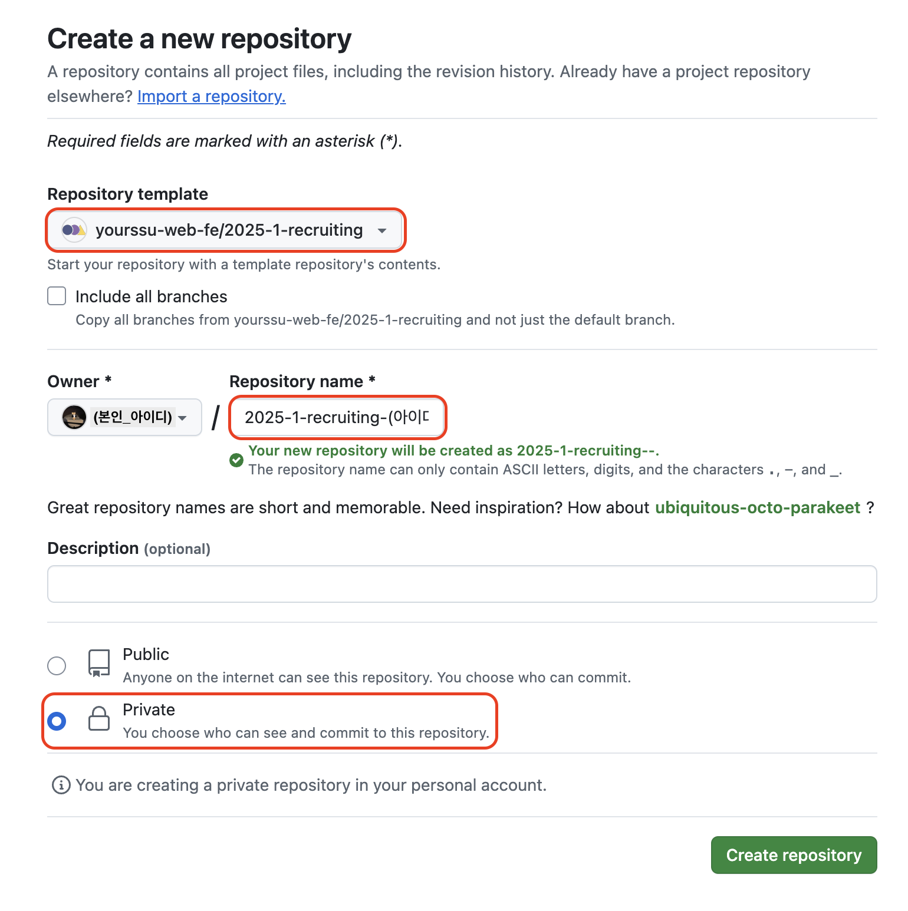
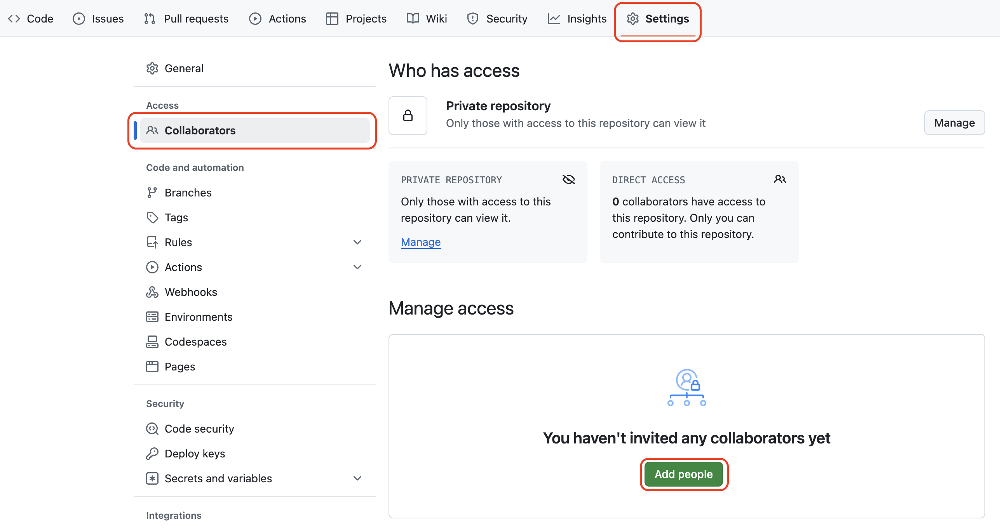
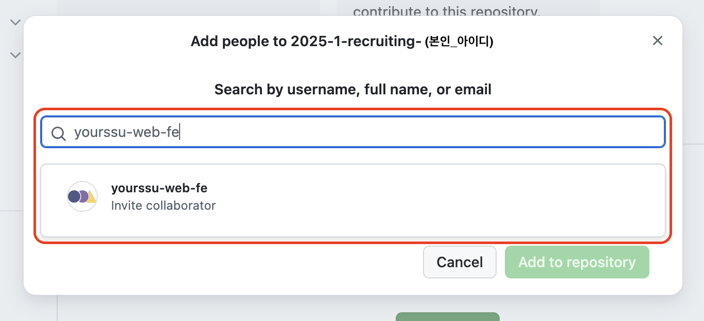

# ⏰ 2025-1 Web FE 팀 리크루팅 과제

## 과제 제출 방법

### 1. 과제 저장소 접속

### 2. 본인의 비공개 저장소 생성하기


- 과제 저장소에서 `Use this template` -> `Create a new repository`를 클릭하여 본인 계정 하위에 새 저장소를 만들 수 있습니다.

<p align="center">
  
</p>

- Owner를 **지원서에 제출한 본인의 GitHub 계정**으로 선택하고 **비공개(Private)** 로 새 저장소를 만듭니다.
- 저장소 이름은 템플릿 저장소의 이름(과제 이름) 뒤에 본인의 GitHub 사용자 이름을 붙입니다.
  - 예시) 2025-1-recruiting-yourssu
- **만약 공개 저장소로 생성하여 다른 사람의 코드와 유사한 경우 부정행위로 간주하여 불이익이 있으니 유의해 주세요.**

### 3. 유어슈 계정을 collaborator로 초대하기

<p align="center">


</p>

- 생성한 저장소의 `Settings` -> `Collaborators` -> `Add people` 에서 `yourssu-web-fe` 계정을 collaborator로 초대합니다.
- 초대를 완료하면 위와 같이 `Pending Invite` 상태인 것을 확인할 수 있습니다. 초대 수락은 과제 제출 기간 중에 일괄로 진행됩니다. 초대 수락을 위해 지원자가 추가로 하셔야 할 일은 없습니다.
- **안내된 시간까지 `yourssu-web-fe` 계정을 collaborator로 초대하지 않은 경우 0점 처리**됩니다.
- **Collaborator 설정을 잊어버리는 것을 방지하기 위해 저장소를 생성할 때 바로 설정하는 것을 추천합니다.**
- 오타 등을 수정하기 위해 저장소의 이름을 변경한 경우 `yourssu-web-fe` 계정을 collaborator로 다시 초대해 주세요.

### 4. 과제 진행하기

- 설정을 완료한 본인의 비공개 저장소를 로컬 환경에 clone 받아 과제를 진행해주세요.
- 진행한 과제는 저장소의 main 브랜치에 커밋해주세요.
  - 과제 제출 시간을 넘겨서 제출한 커밋은 인정되지 않으니 유의해 주세요.

# 과제: 시간표 추천 페이지 구현하기

## 과제 진행 요구 사항

- 과제 구현에 사용할 기술 스택은 자유이지만 해당 기술을 사용한 이유를 `README.md`에 작성해주세요.
- 과제를 수행하면서 느낀 점, 배운 점, 많은 시간을 투자한 부분 등이 있다면 `README.md`에 자유롭게 작성해주세요.

## 기능 요구 사항

- 주어진 Figma 링크를 참고하여 시간표 추천 페이지를 구현해주세요.
  - [2025-1 Web FE 팀 리크루팅 과제 Figma](https://www.figma.com/design/AJrQex5wnCDFsbyhEeMUtm/2025-1-Web-FE%ED%8C%80-%EB%A6%AC%ED%81%AC%EB%A3%A8%ED%8C%85-%EA%B3%BC%EC%A0%9C?node-id=1-10973&t=gQ4Bo0XlXb5nAYoU-1)
- 시간표 추천 페이지에서 보여줄 시간표 데이터는 주어진 API를 통해 받아와주세요.
- 기능 요구 사항에 기재되지 않은 내용은 스스로 판단하여 구현해주세요.

### 시간표

- 시간표의 요일은 **월, 화, 수, 목, 금** 5개의 요일만 존재해요.
- 시간표에 표시할 모든 수업은 **9시 이후에 시작하고 23시 이전에 종료**해요.
- 시간표의 시간은 **9시**부터 표시해야 해요.
  - 9시에 시작하는 수업이 없더라도 시간표에 9~10시 칸을 표시해야 해요.
- 시간표의 시간은 **가장 늦게 종료되는 수업의 종료 시각을 포함한 시간**까지 표시해야 해요.
  - 예) Figma 예시 시간표에서 가장 늦게 종료되는 수업인 `컴퓨터시스템기초`는 4\~5시 사이에 종료되므로 시간표에 4\~5시 칸까지 표시해야 해요.
- 시간표에 표시할 수업들은 **수업 시간에 비례한 크기**를 가져야 해요.

  - 예) Figma 예시 시간표에서 11시에 시작해서 12시 30분에 끝나는 수업인 `C프로그래밍 및 실습` 수업은 11\~12시 칸을 넘어 12\~1시 칸의 절반 지점까지 표시해야 해요.

- API 응답 데이터의 `tag` 값에 따라 적절한 태그를 표시해야 해요.

  - 아래 `TIME_TABLE_TAG` 객체를 참고하여 적절한 태그를 표시해 주세요.

  ```js
  const TIME_TABLE_TAG = {
    DEFAULT: "🤔 뭔가 좋아보이는 시간표",
    HAS_FREE_DAY: "🥳 공강 날이 있는 시간표",
    NO_MORNING_CLASSES: "⏰ 아침 수업이 없는 시간표",
    NO_LONG_BREAKS: "🚀 우주 공강이 없는 시간표 ",
    EVENLY_DISTRIBUTED: "⚖️ 균등하게 배분되어 있는 시간표",
    GUARANTEED_LUNCH_TIME: "🍔 점심시간 보장되는 시간표",
    NO_EVENING_CLASSES: "🛏 저녁수업이 없는 시간표",
  };
  ```

### `이 시간표가 좋아요` 버튼

- `이 시간표가 좋아요` 버튼을 클릭하면 시간표 태그 부분의 배경 색과 시간표의 테두리 색이 `#6b5cff` 로 바뀌어야 해요.

## API 요구 사항

- 시간표 추천 페이지에서 보여줄 시간표 데이터는 https://api.dev.soongpt.yourssu.com/api/timetables 로 GET 요청을 보내 받아와주세요.
- 응답 데이터에는 시간이 겹치는 수업이 없으니 시간 중복에 대한 예외 처리는 고려하지 않아도 돼요

### API 응답 데이터

- API 응답 데이터는 아래와 같은 형식이에요.

```json
{
  "timestamp": "2025-03-04 00:00:00",
  "result": {
    "timetableId": 405,
    "tag": "HAS_FREE_DAY",
    "score": null,
    "totalCredit": 9,
    "courses": [
      {
        "courseName": "인공지능수학",
        "professorName": "백두원",
        "classification": "MAJOR_ELECTIVE",
        "credit": 3,
        "courseTime": [
          {
            "week": "화",
            "start": "16:30",
            "end": "17:45",
            "classroom": "정보과학관 21601"
          },
          {
            "week": "수",
            "start": "12:00",
            "end": "13:15",
            "classroom": "정보과학관 21601"
          }
        ]
      },
      {
        "courseName": "게임개발방법론",
        "professorName": "오경수",
        "classification": "MAJOR_ELECTIVE",
        "credit": 3,
        "courseTime": [
          {
            "week": "수",
            "start": "10:30",
            "end": "11:45",
            "classroom": "정보과학관 21508"
          },
          {
            "week": "금",
            "start": "10:30",
            "end": "11:45",
            "classroom": "정보과학관 21508"
          }
        ]
      },
      {
        "courseName": "고급자바프로그래밍및실습",
        "professorName": "정다니엘",
        "classification": "MAJOR_ELECTIVE",
        "credit": 3,
        "courseTime": [
          {
            "week": "화",
            "start": "13:30",
            "end": "14:20",
            "classroom": "정보과학관 21503"
          },
          {
            "week": "화",
            "start": "14:30",
            "end": "15:20",
            "classroom": "정보과학관 21503"
          },
          {
            "week": "수",
            "start": "15:00",
            "end": "15:50",
            "classroom": "정보과학관 21503"
          },
          {
            "week": "수",
            "start": "16:00",
            "end": "16:50",
            "classroom": "정보과학관 21503"
          }
        ]
      }
    ]
  }
}
```

- 응답 데이터의 `tag`는 아래와 같은 값을 가질 수 있어요.

```ts
  | "DEFAULT"
  | "HAS_FREE_DAY"
  | "NO_MORNING_CLASSES"
  | "NO_LONG_BREAKS"
  | "EVENLY_DISTRIBUTED"
  | "GUARANTEED_LUNCH_TIME"
  | "NO_EVENING_CLASSES"
```

- 응답 데이터의 `classification`은 아래와 같은 값을 가질 수 있어요.

```ts
  | "MAJOR_REQUIRED" // 전공필수
  | "MAJOR_ELECTIVE" // 전공선택
  | "GENERAL_REQUIRED" // 교양필수
  | "GENERAL_ELECTIVE" // 교양선택
  | "CHAPEL" // 채플
```

- 응답 데이터의 `score`는 사용하지 않는 값이니 무시해도 괜찮아요.
